<div align="center">
  <a href="https://builder6.com">
    
  </a>

  <h1 align="center">Builder6 Runtime</h1>

  <p align="center">
    <strong>The Execution Engine for Builder6 Applications</strong>
    <br />
    Metadata-Driven | Private Deployment | High Performance
  </p>

  <p align="center">
    <a href="LICENSE">
      
    </a>
    <a href="https://hub.docker.com/r/builder6/runtime">
      
    </a>
    <a href="https://github.com/builder6app/builder6.app/releases">
      
    </a>
  </p>

  <p align="center">
    <a href="#-introduction">Introduction</a> •
    <a href="#-how-it-works">How It Works</a> •
    <a href="#-key-features">Key Features</a> •
    <a href="#-quick-start">Quick Start</a>
  </p>
</div>

---

## 📖 Introduction

**Builder6 Runtime** (`builder6.app`) is a high-performance, metadata-driven execution environment designed to run applications created with [Builder6 Cloud](https://github.com/builder6app/builder6.com).

Think of **Builder6 Cloud** as the "Editor" and **Builder6 Runtime** as the "Player."

Once you have designed your application (Data Models, UIs, and Logic) in the cloud, you can export it as a standard package and deploy it here. This ensures that while you enjoy the speed of cloud development, your **production data remains 100% private** on your own infrastructure.

---

## 🔄 How It Works

Bridging the gap between Cloud Development and On-Premise Execution.

```mermaid
graph LR
    Build[☁️ Builder6 Cloud] -->|1. Export Metadata| Package(📦 App Package)
    Package -->|2. Load| Runtime[⚙️ Builder6 Runtime]
    
    subgraph Local_Server [🏢 Your Private Infrastructure]
    Runtime -->|3. Read/Write| DB[(Your Database)]
    Runtime -->|4. Serve| User(End User)
    end
    
    style Build fill:#f9f,stroke:#333
    style Runtime fill:#bbf,stroke:#333,stroke-width:2px

```



1. **Build**: Visually define your application in the cloud.
2. **Distribute**: Download the application definition (Metadata Package).
3. **Run**: The Runtime parses the metadata, automatically generating APIs, UI routes, and backend logic, while connecting directly to your local database.

---

## ✨ Key Features

* **🛡️ Data Sovereignty**: The Runtime operates entirely within your network. Your business data never touches the Builder6 Cloud.
* **🚀 Metadata Driven**: No compilation required. Simply update the configuration files (YAML/JSON) to modify the application behavior instantly.
* **⚡ High Performance**: Built on a Node.js microservices architecture, capable of handling high concurrency and horizontal scaling.
* **🔌 API First**: Automatically generates GraphQL and RESTful APIs for all your defined data models.
* **🐳 Docker Ready**: Optimized for containerized environments (Kubernetes, Docker Swarm).

---

## 🚀 Quick Start

### Option 1: Docker (Recommended)

The easiest way to deploy your application is using the official Docker image.

```bash
# Run Builder6 Runtime and map the port
docker run -d \
  -p 3000:3000 \
  -e MONGO_URL=mongodb://your-db-host/builder6 \
  builder6/runtime:latest

```

*Replace `/path/to/your/app-package` with the directory containing the metadata exported from Builder6 Cloud.*

### Option 2: Run from Source

For developers who want to extend the runtime core or debug locally:

1. **Clone the repository**
```bash
git clone [https://github.com/builder6app/builder6.app.git](https://github.com/builder6app/builder6.app.git)
cd builder6.app

```


2. **Install dependencies**
```bash
yarn install

```


3. **Configure Environment**
Copy the example configuration:
```bash
cp .env.example .env
# Edit .env to configure your Database Connection (MONGO_URL)

```


4. **Load Application**
Place your exported metadata files into the `packages` directory (or configure the path in `.env`).
5. **Start the Server**
```bash
yarn start

```


Visit `http://localhost:3000` to access your application.

---

## 🏗️ Tech Stack

* **Core**: Node.js
* **Architecture**: Microservices (Moleculer Framework)
* **Data Storage**: MongoDB (Metadata), SQL/NoSQL (Business Data)
* **API Engine**: GraphQL, REST
* **UI Rendering**: React SSR / Amis Renderer

---

## 🤝 Contributing

Builder6 Runtime is open source. We welcome contributions to improve performance, security, and extensibility.

* **Report Issues**: [GitHub Issues](https://github.com/builder6app/builder6.app/issues)
* **Build Apps**: Go to [Builder6.com](https://builder6.com) to start creating.

## 📄 License

This project is licensed under the [MIT License](https://www.google.com/search?q=MIT).
